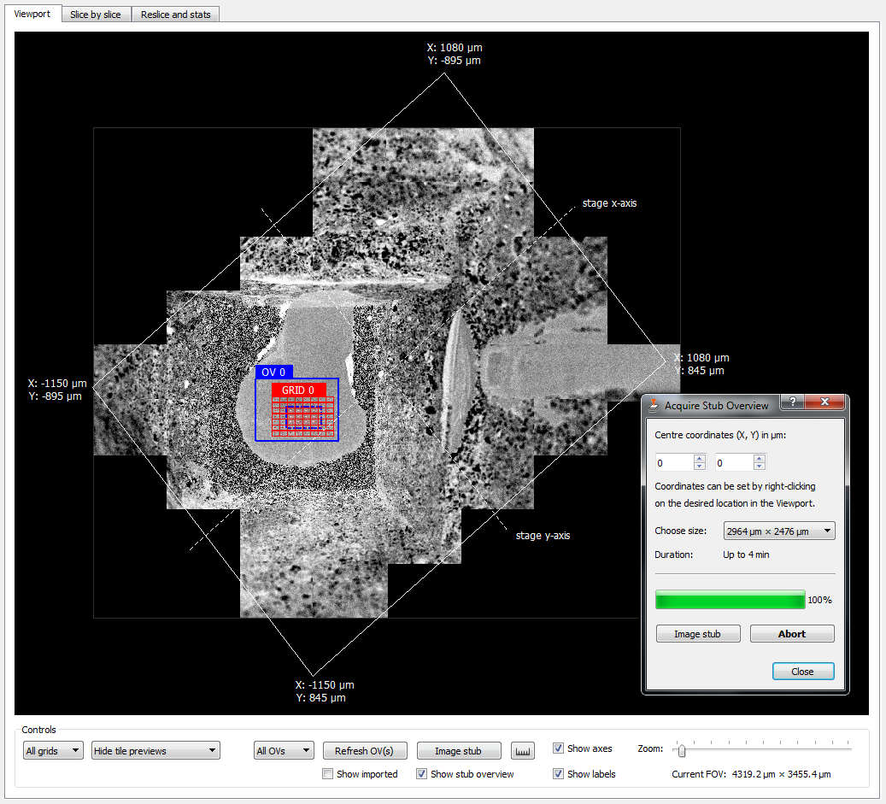
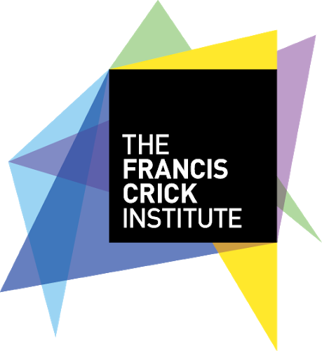

# SBEMimage

Open-source acquisition software for scanning electron microscopy with a focus on serial block-face imaging.

*SBEMimage* is designed for complex, challenging acquisition tasks, such as large-scale volume imaging of neuronal tissue or other biological ultrastructure. Advanced monitoring, process control, and error handling capabilities improve reliability, speed, and quality of acquisitions. Debris detection, autofocus, real-time image inspection, and various other quality control features minimize the risk of data loss. Adaptive tile selection allows for efficient imaging of large volumes of arbitrary shape. The software’s graphical user interface is optimized for remote operation. It includes a user-friendly Viewport to visually set up acquisitions and monitor them.

*SBEMimage* is customizable and extensible, which allows for fast prototyping and permits adaptation to a wide range of SEM/SBEM systems and applications.

For more background and details read the [paper](https://www.frontiersin.org/articles/10.3389/fncir.2018.00054/abstract).

## Highlights

SBEMimage is currently deployed as Open Source software at several institutions worldwide, including:

* Friedrich Miescher Institute in Basel (Switzerland) 
* European Molecular Biology Laboratory (EMBL) Heidelberg (Germany) 
* Francis Crick Institute in London (UK) 
* Stellenbosch University (South Africa) 

It is being used for a variety of applications, including:
* CZI funded Democratising Volumetric Visual Proteomics project together with a napari annotation plugin for targeted Array EM imaging at the Francis Crick Institute (UK) and Stellenbosch University (South Africa)
* MRC funded multi-modal project together with a napari registration plugin for targeted Array EM imaging at EMBL Heidelberg (Germany)

## Documentation & Support

Please read the user guide: [sbemimage.github.io/SBEMimage](https://sbemimage.github.io/SBEMimage).
It currently contains installation instructions and a short introduction to the software (to be expanded). For users who are not familiar with Python, it is recommended to download the Windows 10+ installer.

Detailed generated information can be found here [deepwiki.com/SBEMimage/SBEMimage](https://deepwiki.com/SBEMimage/SBEMimage)

For support and discussion, please use the [Image.sc forum](https://forum.image.sc/) and post to the forum with the tag 'sbemimage'.

## Development

The development of *SBEMimage* at the Friedrich Miescher Institute in Basel has been supported by the Novartis Research Foundation and by the European Research Council (ERC) under the European Union’s Horizon 2020 Research and Innovation Programme (Grant Agreement No. 742576). Other institutes that have substantially contributed to *SBEMimage* development/testing: EPFL, Lausanne, Switzerland (CIME/BioEM); Francis Crick Institute, London, UK.

Current development team: Benjamin Titze ([btitze](https://github.com/btitze)), Friedrich Miescher Institute for Biomedical Research, Basel, Switzerland (lead developer); Thomas Templier, Janelia Research Campus; Joost de Folter, Francis Crick Institute; Philipp Schubert, Max Planck Institute of Neurobiology; and others: https://github.com/SBEMimage/SBEMimage/graphs/contributors

Contact benjamin.titze ÄT protonmail.ch if you are interested in contributing to the development of *SBEMimage*. All ongoing development takes place in the ['dev' branch](https://github.com/SBEMimage/SBEMimage/tree/dev). Pull requests to that branch are welcome. For more information, see the section ['For developers'](https://sbemimage.github.io/SBEMimage//development) in the user guide.

## Feedback and bug reports

Please use GitHub Issues (https://github.com/SBEMimage/SBEMimage/issues) for bug reports. For general feedback or feature suggestions, post to the [Image.sc forum](https://forum.image.sc/) with the tag 'sbemimage', or send an email to benjamin.titze ÄT protonmail.ch.

## Publication

Please cite the following paper if you use SBEMimage:

Titze B, Genoud C and Friedrich RW (2018) [SBEMimage: Versatile Acquisition Control Software for Serial Block-Face Electron Microscopy](https://www.frontiersin.org/articles/10.3389/fncir.2018.00054/full). Front. Neural Circuits 12:54. doi: 10.3389/fncir.2018.00054

## Licence

This software is licensed under the MIT License - see the [LICENSE](LICENSE) file for details.
