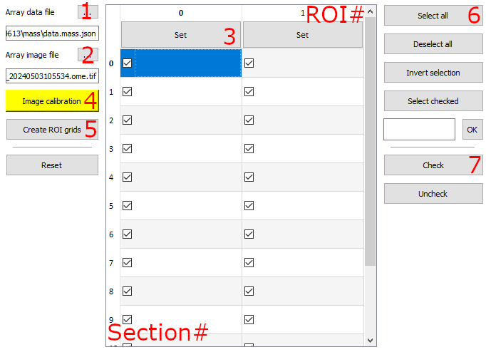
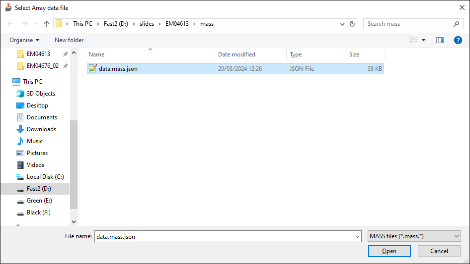

# Array setup

MAGC data or MASS data can be imported in SBEMimage, using the Array tab.

Key sections are annotated and referred to below.

## 1. Array data file

Select button #1 (see annotated image above) to select and import a MASS data file

This will generate template grids for each ROI, allowing grid settings to be changes for each ROI.

## 2. Array image file

Select button #2 to select and import a image file corresponding to the data file

The pixel size, image center and rotation are used if these are present in the image metadata. Suggest setting the transparency to a value of 50%.

## 3. ROI grid settings

Grid settings can be adjusted for each ROI by selecting the 'Set' button in each corresponding column.

## 4. Image calibration

The imported array image can be manipulated like regular imported images and moved, rotated and scaled as desired.

_Alternatively_, a landmark calibration can be performed by selecting the 'Image calibration' button. This requires landmarks defined in the array data file, and in the dialog that opens setting corresponding positions using the device stage movement for each corresponding landmark.

## 5. Create ROI grids

Select the button 'Create ROI grids' to create ROI grids from the imported data file based on the grid settings defined for each ROI. This removes any previously defined array (ROI) grids but respects any other grids.

## 6. Activating ROI tiles

ROI grid tiles can be activated by selecting the desired Section/ROIs in the table or using the 'Select all' button. The selected ROIs grid tiles can then be activated with the 'Check' button.

## 7. Imaging

All active ROI grid tiles can be imaged by starting acquisition normally, or alternatively a single grid or tile can be imaged by right-clicking these and selecting Acquire Grid or Acquire Tile.
