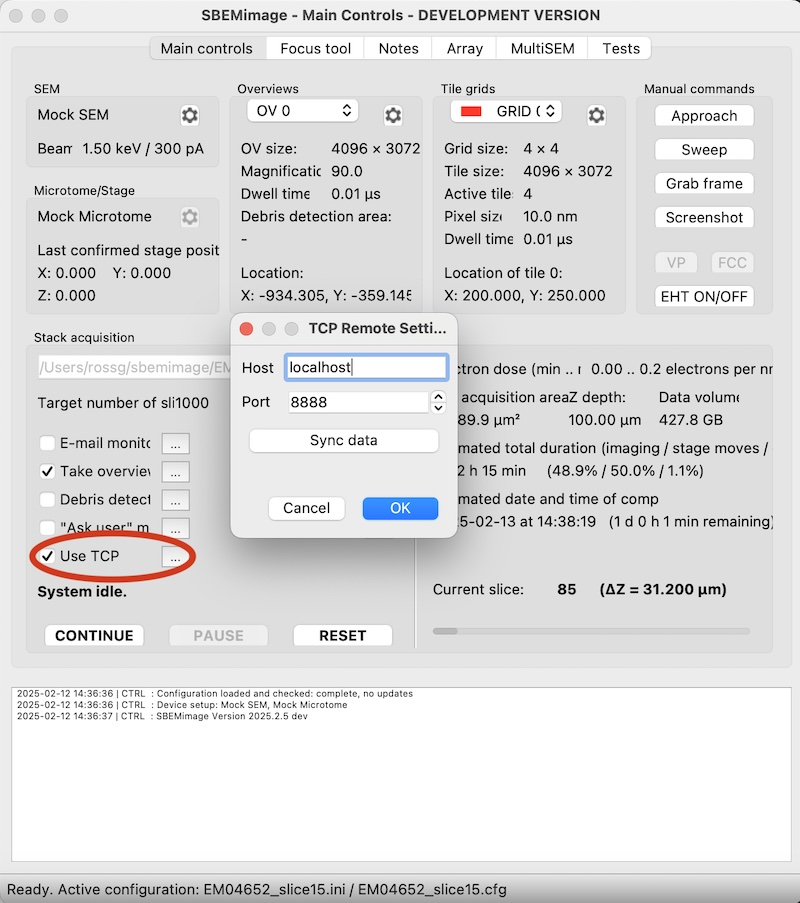

# External tools

External tools can be connected to SBEMimage via the 'Use TCP' option. When the checkbox is active, SBEMimage will send the current state to the given address and port via a TCP request after each new slice is acquired. The external tools can reply with commands to pause the acquisition, add and remove grids and activate and deactivate grid tiles.



SBEMimage will send the following state which can be interpreted by external tools to intelligently manipulate the current acquisition:

```json
{'paused': PAUSE STATE,
 'z_depth': STAGE Z DEPTH,
 'overviews': {'number_ov': LIST OF OVERVIEW IDS,
               'ov_coords': LIST OF OVERVIEW COORDS,
               'ov_dirs': LIST OF OVERVIEW DIRECTORIES},
 'slice_thickness': CURRENT SLICE THICKNESS
}
```

Response commands must be supplied in the form:

```json
{commands: [
    {'msg': 'COMMAND 1', 'args': [], 'kwargs: {}},
    {'msg': 'COMMAND 2', 'args': [], 'kwargs': {}},
]}
```

A full list of available commands are available below:
```json
PAUSE
ACTIVATE OV
DEACTIVATE OV
SET OV INTERVAL
ACTIVATE ARRAY GRID
DEACTIVATE ARRAY GRID
ADD ARRAY GRID
UPDATE GRID TILES WITH MASK
DELETE ALL ARRAY GRIDS
SET SLICE THICKNESS
```