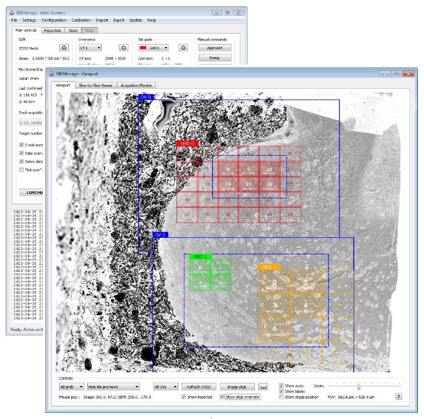

# Overview

Open-source acquisition software for scanning electron microscopy with a focus on serial block-face imaging.

*SBEMimage* is designed for complex, challenging acquisition tasks, such as large-scale volume imaging of neuronal tissue or other biological ultrastructure. Advanced monitoring, process control, and error handling capabilities improve reliability, speed, and quality of acquisitions. Debris detection, autofocus, real-time image inspection, and various other quality control features minimize the risk of data loss. Adaptive tile selection allows for efficient imaging of large volumes of arbitrary shape. The software’s graphical user interface is optimized for remote operation. It includes a user-friendly Viewport to visually set up acquisitions and monitor them.

*SBEMimage* is customizable and extensible, which allows for fast prototyping and permits adaptation to a wide range of SEM/SBEM systems and applications.

This is the user guide for the acquisition software *SBEMimage*.

For support questions and general discussion, please use the [Image.sc
forum](https://forum.image.sc/), with the tag
‘[sbemimage](https://forum.image.sc/tag/sbemimage)’. For bug reports use
[GitHub Issues](https://github.com/SBEMimage/SBEMimage/issues).

The source code of *SBEMimage* is hosted on
[github.com/SBEMimage](https://github.com/SBEMimage/SBEMimage). The
source files for this user guide are located in the folder
[/docs](https://github.com/SBEMimage/SBEMimage/tree/master/docs).

